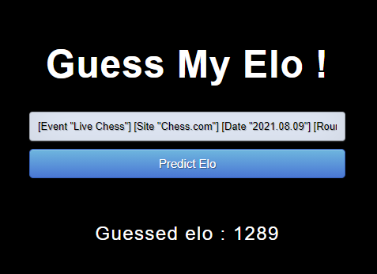

# Chess Guess My Elo - Project Overview

Inspired by videos of famous chess youtubers, the goal of this project is to guess the elo of a game by looking at the  moves played.
- Creation of a dataset of more than 17000 games from Chess.com with a wide range of elos, computation of Stockfish evaluation for each game
- Cleaning of the dataset, feature engineering (creation of meaningful variables from the moves played)
- Training, optimization and comparaison of Machine Learning models including RandomForest, Linear models, Multi Layer Perceptron using GridsearchCV
- Deployment of the model using Flask, creation of an API and a simple HTML form to interract with it (see picture lower).

## Ressources used

### Libraries

**Creation of the dataset** : chessdotcom, python-chess, request, pickle

**Data cleaning and feature engineering** : pandas, numpy

**Model selection and optimization** : sklearn

**Deployment** : flask, json, request

### Others

Youtube serie ["Data Science Project from Scratch"](https://www.youtube.com/playlist?list=PL2zq7klxX5ASFejJj80ob9ZAnBHdz5O1t) from [Ken Jee](https://github.com/PlayingNumbers)

Youtube videos about Flask (and much more) from [Krish Naik](https://www.youtube.com/user/krishnaik06)

Toward Data Science Article : [Productionize a Machine Learning model with Flask and Heroku](https://towardsdatascience.com/productionize-a-machine-learning-model-with-flask-and-heroku-8201260503d2)

## Creation of the dataset

I first looked for a dataset of games respecting the following criterias : wide variety of elo, with engine evaluation, but most importantly from chess.com (because the elo of a player on chess.com will not be similar to his elo on Lichess for example). I have not encountered such a dataset, so I decided to create it.

The dataset has been created with the Chess.com api and with chessdotcom (a python wrapper for this API). The API does not allow to access random games so the dataset has been made by finding the games played by a player, the games played by the opponents of the player, the games of the opponents of the opponents of the player...

All the games have been selected to be rated games, in Blitz mode and with a low elo difference between the two players (<100). The games elo are between 300 and 2500.

A game is represented by a PGN, which a format widely used in the chess industry to store informations (players, ratings, moves...) from a game.

For evaluating the quality of the moves, [Stockfish14](https://stockfishchess.org/download/) has been used with a depth of 15, a good compromise between reliability of evaluation and time of computation.

Pandas has been used to clean the dataset, drop duplicates, drop games with less than 10 moves and others.

## Feature Engineering

From the raw data of the games and the evaluations, different features have been selected :

- `elo` : mean of the elo of the wo players, this is the variable to predict
- `advantage_at_5` : absolute value of the advantage at the 5th move
- `advantage_at_10` : absolute value of the advantage at the 10th move
- `nb_moves` : number of moves in the game
- `nb_checks` : number of checks in the game
- `move_quality_1`, ..., `move_quality_8` : each move is evaluated by the difference between the move and the Stockfish optimal move, and is categorized between 1 (excellent) and 8 (terrible). The 8 variables indicate the percentage of moves in each category
- `ending`: categorical variable indicating how the game ended. There are 8 values which are 'Resignation', 'Win on time', 'Stalemate', 'Abandon', 'Checkmate', 'Drawn by agreement', 'Drawn by lack of material' and 'Drawn by repetition or by 50 moves rule'
- `opening` : categorical variable for the opening, following the ECO classification system.  The 153 openings used more than 50 times have been kept, the others are labelled as 'Other'.
- `analysis1`, ..., `analysis4` : at every move the position is evaluated by stockfish, and then categorized between 1 (close game) and 4 (huge advantage). The 4 variables indicate the percentage of time in each category

Some machine learning algorithms can't work with categorical variable, so `opening` and `endind` will be transformed to one-hot encoding leading us to have 178 input features.

## Model Building
I started by splitting the dataset into a train set (80%) and a test set (20%).

I trained and compared different models from the Scikit-Learn libray. This include RandomForestRegressor, multiple linear regression models (Lasso, Ridge...) and MultiLayerPerceptron.

For each of these models, the optimal hyperparameters have been found thanks to GridsearchCV.

The MultiLayerPerceptron outperformed the other models, here are the optimals hyperparameters for it :
```
MLPRegressor(activation='relu',
             alpha=0.001,
             early_stopping=False,
             hidden_layer_sizes=(100, 75, 50),
             learning_rate='constant',
             learning_rate_init=0.001,
             max_iter=500,
             solver='adam')
```
The model gives a MAE of 370.

The combination of different models did not give good results.

## Productionization using Flask

I built a Flask API endpoint that is hosted on a local webserver.

The point of the API is not to predict the elo of a game from all the computed features but to give a prediction from the PGN of a game. To do so, I had to include Stockfish to compute analysis of the game, and to compute all the features in the Flask application. Once all the features are processed, we can use our previously trained model to predict the elo of the game.

I also made the API works with a simple HTML form, wich allows to paste the PGN of a game and get as a result the elo guessed by our model (see figue below). 

